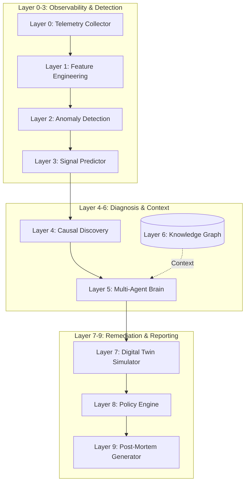

# AIOps Autonomous Self-Healing Platform


## Executive Summary

The **AIOps Autonomous Self-Healing Platform** is an enterprise-grade, event-driven infrastructure monitoring and autonomous self-healing system. Developed as a comprehensive capstone project, this platform addresses the critical challenge of modern Site Reliability Engineering (SRE): reducing Mean Time to Resolution (MTTR) without introducing the risks associated with non-deterministic AI remediation. 

By employing a deterministic multi-agent brain backed by machine learning for anomaly detection, causal discovery, and a digital twin queueing theory simulator, the platform achieves zero-hallucination, sub-millisecond root cause analysis and safe autonomous remediation.

## What Makes This Novel?

While commercial tools like Datadog, Splunk, or Dynatrace provide excellent observability, they often stop at alerting or rely on non-deterministic LLMs for remediation advice. This platform introduces several novel paradigms:

1. **Deterministic Multi-Agent Brain**: Unlike generative AI pipelines that can hallucinate dangerous infrastructure commands, this uses a deterministic rules-engine over 15 SRE archetypes (0% hallucination, 0.037ms latency).
2. **Digital Twin Simulation via Queueing Theory**: Before any fix is executed, a mathematical model simulates the fix against the current load. If the twin predicts failure, the fix is aborted.
3. **Autonomous Chaos Engineering (Active Learning)**: The system can autonomously inject faults (e.g., CPU spikes, memory leaks) into itself to validate its own diagnostic pathways and populate its incident memory.
4. **Federated Causal Knowledge Graph**: A Neo4j-backed graph tracking 8 core services, their dependencies, and the calculated blast radius of any node failure.
5. **True Dual-Mode Operation**: Runs as a full Docker-Compose orchestrated microservice suite with a React Web UI, or as a standalone lightweight Python CLI tool for embedded environments.

## 10-Layer Architecture Pipeline



## Two Modes of Operation

### 1. Website Mode (Microservices)
Runs the full event-driven architecture using Kafka, FastAPI, React, and various databases.
```bash
# Start all infrastructure and microservices
docker-compose up -d

# Access the Command Center UI:
# http://localhost:8001/5173
```

### 2. Standalone Python CLI Mode
Runs the exact same 10-layer pipeline completely in-memory, without Docker or databases. Ideal for CI/CD testing or embedded edge devices.
```bash
# Install dependencies
pip install -r requirements.txt

# Launch interactive CLI
python aiops_cli.py
```

## Technology Stack & Rationale

| Domain | Technology | Rationale |
|---|---|---|
| **Backend API** | FastAPI (Python) | High performance, native async support, automated OpenAPI docs. |
| **Event Bus** | Apache Kafka | Decouples services, ensures reliable event delivery for high-throughput metrics. |
| **Frontend** | React 18, Vite, Mantine v7 | Fast compilation, robust component library for complex dashboards. |
| **Time Series DB** | InfluxDB | Optimized for writing and querying high-velocity telemetry data. |
| **Graph DB** | Neo4j | Essential for mapping microservice dependencies and calculating blast radius. |
| **Vector DB** | ChromaDB | Used as an "Incident Memory" to find semantically similar past outages. |
| **Machine Learning** | Scikit-learn (Isolation Forest) | Highly effective for unsupervised anomaly detection in high-dimensional spaces. |

## Repository Structure
```text
aiops-platform-starter/
├── aiops_cli.py                # Standalone CLI entrypoint
├── docker-compose.yml          # Infrastructure orchestration
├── requirements.txt            # Python dependencies
├── docs/                       # Architectural documentation
├── services/                   # Microservice source code
│   ├── anomaly-detection/      # Isolation Forest & Feature eng
│   ├── api-gateway/            # FastAPI entrypoint
│   ├── causal-discovery/       # Granger causality approximations
│   ├── collector/              # Psutil telemetry gathering
│   ├── command-center/         # React/Vite Frontend
│   ├── digital-twin/           # Queueing theory simulator
│   ├── forecasting/            # Capacity wall prediction
│   ├── incident-memory/        # ChromaDB integration
│   ├── knowledge-graph/        # Neo4j schema and data
│   ├── log-intelligence/       # NLP log analysis
│   ├── multi-agent/            # Deterministic SRE brain
│   └── policy-engine/          # Safety gates and execution
├── shared/                     # Shared models and 50+ incident corpus
└── tests/                      # Pytest suite
```

## Feature Highlights
- **12-Dimensional Feature Vectors**: Calculates derived metrics like `cpu_per_request`, `memory_leak_slope`, and Little's Law residuals.
- **5-Gate Safety Policy**: Every fix must pass Cooldown, Confidence, Corroboration, Availability, and Risk gates.
- **Auto-Generated Post Mortems**: Markdown incident reports are generated automatically via Layer 9.
- **Stress-Tested Performance**: Proven to handle 10,000 events in under 5 seconds in integration testing.

## Screenshots / Demo
*(Placeholder for actual application screenshots)*
- **Command Center Dashboard**: ``
- **CLI Interactive Mode**: ``
- **Knowledge Graph Visualization**: ``

## Design Thought Process
For an in-depth look at why specific algorithms, architectures, and design patterns were chosen, please read the [THOUGHT PROCESS](THOUGHT_PROCESS.md) document.

## Contributing
This is an academic capstone project. While PRs are welcome, the primary goal is architectural demonstration. Please ensure all tests pass (`pytest tests/test_aiops_platform.py`) before opening a PR.
