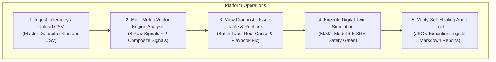
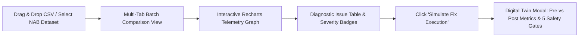
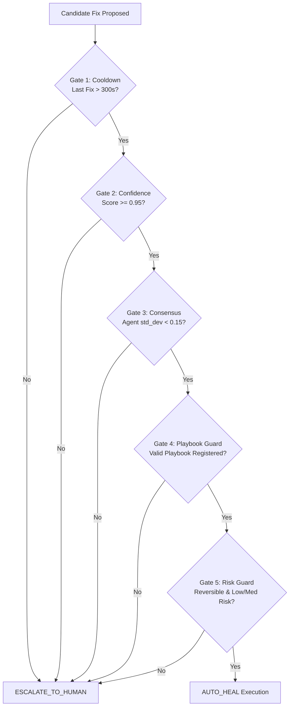

# 📖 User Guide: AIOps Autonomous Self-Healing Platform

Welcome to the official operational manual for the **AIOps Autonomous Self-Healing Platform**. This guide provides comprehensive, step-by-step instructions for operating the platform across its **Dual Modes** (Web UI Command Center + Standalone Terminal CLI), ingesting multi-tenant microservice telemetry, analyzing real production datasets, executing Digital Twin simulations, and verifying self-healing policy audit logs.

---

## 📌 Quick Operational Overview

The platform supports **Dual-Mode Architecture**:
1. **Enterprise Web Command Center UI**: React 18 / Vite dashboard backed by FastAPI for interactive visual telemetry analysis, multi-tab CSV comparisons, and live Digital Twin 5-Gate fix simulations.
2. **Standalone Terminal CLI (`aiops_cli.py`)**: Zero-dependency Python engine for automated CI/CD pipelines, headless server execution, and quick terminal diagnostics.



---

## 1. Environment Setup & Deployment Modes

### 1.1 Enterprise Docker Compose Deployment (Recommended for Web UI)

To launch the full containerized microservices stack (Apache Kafka, FastAPI Gateway, React UI, InfluxDB, Neo4j, ChromaDB, and Grafana):

```bash
# 1. Start all Docker containers in background
docker compose up -d --build

# 2. Verify microservices health status
docker compose ps
```

#### Active Service Endpoints & Network Map:
* **React Command Center UI**: [http://localhost:5173](http://localhost:5173) or [http://localhost:8001](http://localhost:8001)
* **FastAPI Gateway & Interactive Swagger Docs**: [http://localhost:8001/docs](http://localhost:8001/docs)
* **Neo4j Graph Topology Browser**: [http://localhost:7474](http://localhost:7474) (Credentials: `neo4j` / `devpassword123`)
* **InfluxDB Time-Series Console**: [http://localhost:8086](http://localhost:8086) (Credentials: `admin` / `devpassword123`)
* **Grafana Telemetry Dashboards**: [http://localhost:3000](http://localhost:3000) (Credentials: `admin` / `admin`)
* **Kafka Message Broker**: `localhost:9092`

---

### 1.2 Standalone Terminal CLI (`aiops_cli.py`)

For headless server management, local offline testing, or integration into CI/CD build steps, use the CLI. The CLI executes the complete 10-layer pipeline without requiring Docker containers or external databases.

```bash
# Interactive Command Center Menu
python aiops_cli.py

# Execute full 10-layer telemetry-to-post-mortem pipeline
python aiops_cli.py pipeline

# Stream real-time terminal telemetry monitor for 30 seconds
python aiops_cli.py monitor --duration 30

# Inject synthetic fault archetype & evaluate 5 policy safety gates
python aiops_cli.py chaos cpu_spike

# Ingest and diagnose custom enterprise CSV telemetry file
python aiops_cli.py csv datasets/master_all_metrics_incident_dataset.csv

# Simulate Digital Twin fix execution for connection pool exhaustion
python aiops_cli.py twin increase_db_pool_size

# Run automated 37-test PyTest integration suite
pytest tests/test_aiops_platform.py
```

---

## 2. Telemetry Ingestion & Dataset Suite

The platform ingests telemetry streams containing **8 raw metric fields + 2 derived composite signals** per record.

### 2.1 Standard 10-Field Telemetry Schema

```csv
timestamp,company_id,service_name,cpu_percent,memory_percent,response_time_ms,error_rate,active_connections,throughput_rps,queue_depth,db_query_time_ms
2026-09-25T14:00:00Z,Acme-Corp,payment-api,42.0,55.0,120.0,0.1,220,1200,8,35.0
2026-09-25T14:06:00Z,Acme-Corp,payment-api,88.5,65.0,3200.0,28.5,985,850,48,2850.0
```

| Field Name | Type | Unit / Range | Description |
|---|---|---|---|
| `timestamp` | ISO-8601 | String | UTC sample timestamp |
| `company_id` | String | Identifier | Multi-tenant tenant ID (`Acme-Corp`) |
| `service_name` | String | Identifier | Target microservice (`payment-api`, `order-service`) |
| `cpu_percent` | Float | $0.0 - 100.0\%$ | Host CPU utilization |
| `memory_percent` | Float | $0.0 - 100.0\%$ | Memory RAM utilization |
| `response_time_ms` | Float | Milliseconds | End-to-end HTTP response latency |
| `error_rate` | Float | $0.0 - 100.0\%$ | HTTP 5xx error percentage |
| `active_connections` | Integer | Count | Open TCP/database pool sockets |
| `throughput_rps` | Integer | Requests / Sec | Successful QPS throughput |
| `queue_depth` | Integer | Count | Backlog message/task queue length |
| `db_query_time_ms` | Float | Milliseconds | Database execution query latency |

---

### 2.2 Master All-Metrics Dataset (`datasets/master_all_metrics_incident_dataset.csv`)

The repository includes a pre-packaged master dataset containing **40 timestamped records across 4 microservices**, demonstrating system progression through major failure modes:

1. **`payment-api` (Records 1-11)**: Database connection pool exhaustion. Active connections climb to $1,000$, response time reaches $4,200\,\text{ms}$, and DB query time spikes to $3,500\,\text{ms}$.
2. **`order-service` (Records 12-21)**: High-QPS CPU saturation. CPU reaches $99.2\%$, QPS surges to $2,250\,\text{RPS}$, and queue depth reaches $130$.
3. **`inventory-service` (Records 22-31)**: Monotonic memory leak. Memory increases from $45\%$ to $99.2\%$, causing latency to degrade to $2,100\,\text{ms}$.
4. **`gateway-service` (Records 32-41)**: Network partition / upstream isolation. Error rate jumps to $92.0\%$ with response timeouts up to $18,000\,\text{ms}$.

#### CLI Ingestion of Master Dataset:
```bash
python aiops_cli.py csv datasets/master_all_metrics_incident_dataset.csv
```

---

### 2.3 Dedicated All-Metric Sample CSV Directory (`datasets/sample_upload_csvs/`)

For targeted testing of specific failure modes, use the ready-to-upload CSV files located in `datasets/sample_upload_csvs/`:

* `sample_db_pool_exhaustion.csv`: Ingest to test DB connection starvation detection (`increase_db_pool_size`).
* `sample_cpu_saturation.csv`: Ingest to test compute bottleneck detection (`horizontal_scale_out`).
* `sample_memory_leak.csv`: Ingest to test RAM growth detection (`staggered_restart`).
* `sample_network_partition.csv`: Ingest to test packet drop detection (`trip_circuit_breaker`).

---

### 2.4 49 Real Production NAB Datasets

The Web UI includes pre-loaded dropdown access to **49 real production datasets** from the Numenta Anomaly Benchmark (NAB), totaling **324,447 records**:

* **AWS CloudWatch EC2**: Real CPU utilization metrics from live EC2 instances.
* **AWS RDS & Databases**: Real database query and CPU latency metrics.
* **AWS Load Balancers (ELB)**: Real HTTP request count spikes and ELB latency.
* **Known Outages & Incidents**: Real historical cloud outages (e.g. AWS ASG misconfigurations).
* **Traffic & System Latency**: Real ad exchange CPM traffic and latency traces.

---

## 3. Web UI Command Center Walkthrough (`CsvAnalyzer.tsx`)

Access the Web Command Center at **`http://localhost:5173`** and navigate to the **CSV Incident Analyzer** section.



### 3.1 Step-by-Step UI Operations

1. **Company ID Tagging**: Enter your enterprise tenant name (e.g., `Acme-Corp` or `AWS-Production-Cluster`) in the input box.
2. **Uploading Custom CSV Files**:
   * Drag and drop one or multiple CSV files (e.g., `master_all_metrics_incident_dataset.csv` or any file from `datasets/sample_upload_csvs/`) into the dropzone.
   * Click **Analyze Uploaded CSV Files**.
3. **Selecting Pre-Loaded NAB Datasets**:
   * Select a category from the dropdown (e.g., *AWS CloudWatch EC2* or *AWS RDS & Databases*).
   * Choose a specific dataset file and click **Analyze Pre-Loaded Dataset**.
4. **Batch Comparison Tabs**:
   * Switch between uploaded files using the top tab bar to compare diagnostic results across microservices simultaneously.
5. **Telemetry Graph Analysis**:
   * Inspect synchronized metric charts (CPU%, Memory%, Response Time, Error Rate) plotted over time using Recharts.
6. **Diagnostic Issue Table**:
   * Review flagged anomalies, severity ratings (`CRITICAL`, `HIGH`, `MEDIUM`), calculated confidence percentages, isolated root causes, and recommended playbook actions.
7. **Digital Twin 5-Gate Simulation Modal**:
   * Click **Simulate Fix Execution** on any anomaly row.
   * A glassmorphic modal opens, displaying:
     * **Pre-Fix vs Post-Fix Metrics**: Predicted latency drop (e.g., $3,200\,\text{ms} \rightarrow 160\,\text{ms}$), error rate reduction ($28.5\% \rightarrow 0.2\%$), and connection stabilization.
     * **5 Policy Gate Statuses**: Cooldown, Confidence ($\ge 0.95$), Consensus, Playbook Guard, and Risk Guard verification.
     * **Auto-Generated Incident Post-Mortem Report**: Complete Markdown report rendered live.

---

## 4. REST API Endpoint Reference

The FastAPI Gateway (`main.py`) exposes high-performance REST and Server-Sent Events (SSE) endpoints.

### 4.1 Ingest & Analyze Custom CSV (`POST /api/upload-csv`)
Ingests raw CSV bytes, tags records with `company_id`, runs multi-metric vector scoring, and returns diagnostic results.

```bash
curl -X POST "http://localhost:8001/api/upload-csv?company_id=Acme-Corp" \
  -H "Content-Type: text/csv" \
  --data-binary "@datasets/master_all_metrics_incident_dataset.csv"
```

#### Example Response:
```json
{
  "status": "success",
  "company_id": "Acme-Corp",
  "filename": "master_all_metrics_incident_dataset.csv",
  "total_records_processed": 40,
  "anomalies_detected_count": 24,
  "anomalies": [
    {
      "row": 8,
      "company_id": "Acme-Corp",
      "service_name": "payment-api",
      "timestamp": "2026-09-25T14:06:00Z",
      "severity": "critical",
      "confidence": "99%",
      "root_cause": "db_connection_pool_exhaustion",
      "action": "increase_db_pool_size",
      "policy_decision": "AUTO_HEALED (5/5 Safety Gates Passed)"
    }
  ]
}
```

---

### 4.2 List Sample NAB Datasets (`GET /api/list-sample-datasets`)
Returns all 49 pre-loaded NAB datasets grouped by enterprise category.

```bash
curl -X GET "http://localhost:8001/api/list-sample-datasets"
```

---

### 4.3 Analyze Pre-Loaded NAB Dataset (`POST /api/analyze-dataset`)
Analyzes a specific NAB dataset file from disk.

```bash
curl -X POST "http://localhost:8001/api/analyze-dataset" \
  -H "Content-Type: application/json" \
  -d '{"dataset_name": "realAWSCloudwatch/rds_cpu_utilization_cc0c53.csv", "company_id": "AWS-RDS-Cluster"}'
```

---

### 4.4 Digital Twin Fix Simulation (`POST /api/simulate-fix-execution`)
Runs M/M/k queueing simulation and verifies 5 policy safety gates for a target incident.

```bash
curl -X POST "http://localhost:8001/api/simulate-fix-execution" \
  -H "Content-Type: application/json" \
  -d '{
        "row": 8,
        "company_id": "Acme-Corp",
        "service_name": "payment-api",
        "root_cause": "db_connection_pool_exhaustion",
        "action": "increase_db_pool_size",
        "metrics": {"response_time_ms": 3200.0, "error_rate": 28.5, "active_connections": 985}
      }'
```

---

### 4.5 Live Telemetry Streaming (SSE)
* `GET /api/stream/metrics`: Real-time raw metric event stream.
* `GET /api/stream/anomalies`: Live incident diagnosis event stream.
* `GET /api/stream/actions`: Executed remediation event stream.

---

## 5. Multi-Metric Scoring Engine & 5-Gate Policy Logic

### 5.1 Multi-Metric Composite Vector Scoring Matrix

The engine evaluates telemetry against 15 failure archetypes using normalized vector inner products:

$$\text{Score}(\text{Archetype}) = \mathbf{w}^T \mathbf{v} + \text{Bias}_{\text{context}}$$

Where $\mathbf{v}$ contains normalized raw telemetry metrics plus composite signals ($R_{\text{Little}}, R_{\text{cpu\_req}}$), and $\mathbf{w}$ contains calibrated weights.

```text
Normalized Feature Vector v = [
  v_cpu,    # CPU / 100.0
  v_mem,    # Memory / 100.0
  v_rt,     # Response Time / 3000.0
  v_err,    # Error Rate / 50.0
  v_conn,   # Active Conns / 1000.0
  v_queue,  # Queue Depth / 300.0
  v_db,     # DB Latency / 2000.0
  v_rps,    # Throughput / 2500.0
  R_little, # v_conn - (v_rps * v_rt)
  R_cpu_req # v_cpu / max(0.2, v_rps)
]
```

---

### 5.2 The 5 Mandatory SRE Safety Policy Gates

Every candidate remediation must pass all 5 policy gates sequentially. If any gate fails, the decision defaults to `ESCALATE_TO_HUMAN`.



1. **Cooldown Gate**: Rejects remediations on a service executed within the last 300 seconds to prevent flap-looping.
2. **Confidence Gate**: Requires diagnostic confidence score $\ge 0.95$.
3. **Consensus Gate**: Requires agreement among Multi-Agent Brain agents ($\text{std\_dev} < 0.15$).
4. **Playbook Guard**: Verifies that the proposed action matches a registered, schema-validated playbook.
5. **Risk Guard**: Blocks high-risk or destructive actions (e.g. dropping database tables or altering DDL schemas).

---

## 6. Audit Logs & Post-Mortem Verification

All platform executions generate immutable JSON execution traces and formatted Markdown reports:

### Audit File Locations:
* **Self-Healing Audit Logs**: [`logs/self_healing_execution_logs.json`](file:///c:/Users/adith/OneDrive/Desktop/aiops-platform-starter/logs/self_healing_execution_logs.json)
* **50-Scenario Executive Report**: [`logs/SELF_HEALING_AUDIT_REPORT.md`](file:///c:/Users/adith/OneDrive/Desktop/aiops-platform-starter/logs/SELF_HEALING_AUDIT_REPORT.md)
* **49-Dataset ML Execution Logs**: [`logs/ultimate_datasets_execution_logs.json`](file:///c:/Users/adith/OneDrive/Desktop/aiops-platform-starter/logs/ultimate_datasets_execution_logs.json)
* **49-Dataset Performance Report**: [`logs/ULTIMATE_DATASET_PERFORMANCE_REPORT.md`](file:///c:/Users/adith/OneDrive/Desktop/aiops-platform-starter/logs/ULTIMATE_DATASET_PERFORMANCE_REPORT.md)

---

## 7. Troubleshooting & Operational Best Practices

1. **Port Conflicts**: Ensure ports `8001`, `5173`, `9092`, `7474`, `8086`, and `3000` are unblocked before starting Docker Compose.
2. **Offline CLI Execution**: The CLI (`aiops_cli.py`) operates standalone without external databases or Kafka brokers.
3. **Web UI Refresh**: If testing backend CLI script runs, refresh [http://localhost:5173](http://localhost:5173) to load updated audit logs.
