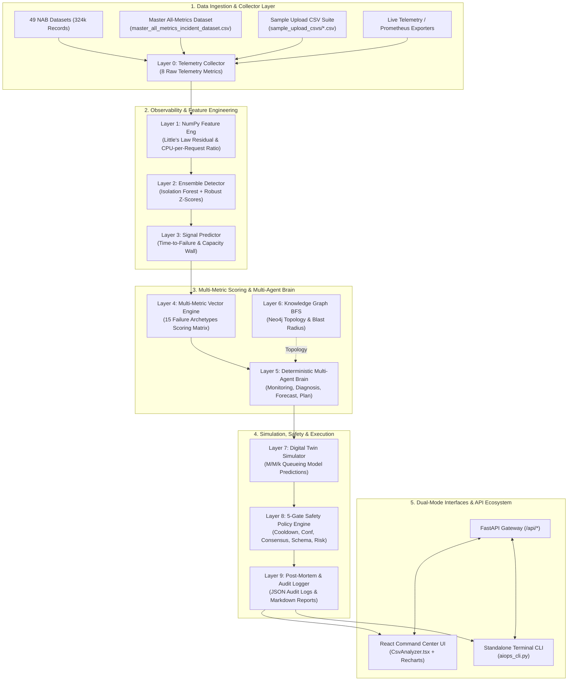
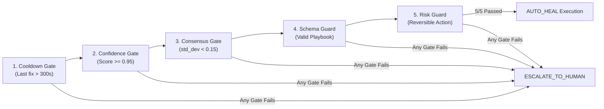
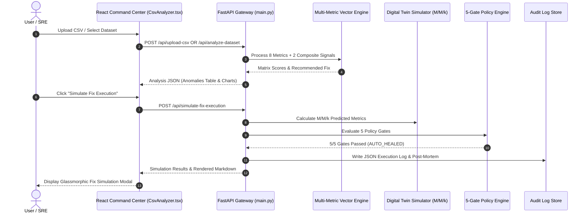
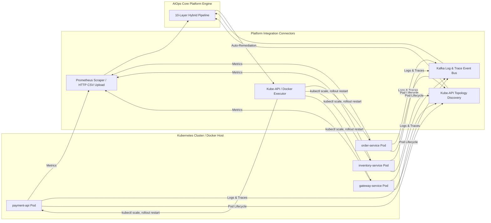

# 🏛️ System Architecture: Enterprise AIOps Autonomous Platform

This document provides the complete technical architectural specification for the **AIOps Autonomous Self-Healing Platform**. Designed for high-concurrency microservices, cloud infrastructure, and Kubernetes environments, the platform features a **10-Layer Hybrid Pipeline** combining vectorized multi-metric machine learning, deterministic multi-agent orchestration, an M/M/k Digital Twin queueing simulator, and a 5-Gate SRE safety policy engine.

---

## 🏗️ High-Level System Architecture Diagram

---

## 🔬 Deep 10-Layer System Specification

### Layer 0: Telemetry Collector
Ingests metric streams containing **8 raw telemetry metrics**:
1. $\text{CPU Utilization (\%)}$ ($0 - 100\%$)
2. $\text{Memory Utilization (\%)}$ ($0 - 100\%$)
3. $\text{Response Time (ms)}$ ($0 - 30,000\,\text{ms}$)
4. $\text{Error Rate (\%)}$ ($0 - 100\%$)
5. $\text{Active Connections}$ ($0 - 10,000$)
6. $\text{Throughput (RPS)}$ ($0 - 50,000\,\text{QPS}$)
7. $\text{Queue Depth}$ ($0 - 100,000$)
8. $\text{DB Query Time (ms)}$ ($0 - 30,000\,\text{ms}$)

Tagging metadata incorporates `company_id`, `tenant_id`, `service_name`, and `timestamp` for multi-tenant isolation.

---

### Layer 1: NumPy Feature Engineering
Computes 4 derived statistical features over sliding time windows:
* **Little's Law Residual**:
  $$R_{\text{Little}} = \text{clamp}\left(v_{\text{conn}} - (v_{\text{rps}} \cdot v_{\text{rt}}), 0, 1\right)$$
  Measures connection accumulation relative to actual served throughput.
* **CPU-per-Request Ratio**:
  $$R_{\text{cpu\_req}} = \text{clamp}\left(\frac{v_{\text{cpu}}}{\max(0.2, v_{\text{rps}})}, 0, 1\right)$$
  Isolates worker efficiency regressions from linear traffic scaling.
* **Memory Leak Gradient**:
  $$\text{Slope} = \text{Polyfit1D}(t, \text{Memory}, \text{window}=10)$$
* **Tail Skewness**:
  $$\text{Skew} = \text{ResponseTime} - \text{RollingMean}(\text{ResponseTime})$$

---

### Layer 2: Ensemble Anomaly Detector
Combines three complementary detection paradigms:
1. **200-Tree Isolation Forest** ($\text{contamination}=0.04$) on C-arrays.
2. **Adaptive Robust Z-Score** using Median Absolute Deviation (MAD):
   $$\text{Robust Z} = \frac{x_i - \text{Median}(X)}{1.4826 \cdot \text{MAD}(X)} > 3.0$$
3. **Multi-Vector Static Bounds**: Triggers when any normalized vector component breaches critical operational boundaries.

---

### Layer 3: Signal Predictor & Capacity Wall Engine
Estimates remaining Time-to-Failure (TTF) in seconds using linear extrapolation of metric slopes:

$$\text{TTF} = \frac{\text{CapacityLimit} - \text{CurrentValue}}{\text{MetricSlope}}$$

If $\text{TTF} < 60\,\text{seconds}$, the incident severity is upgraded to `CRITICAL`.

---

### Layer 4: Multi-Metric Composite Vector Scoring Engine
Evaluates telemetry vectors against **15 failure archetypes** using a matrix inner-product scoring model:

$$\mathbf{v} = [v_{\text{cpu}}, v_{\text{mem}}, v_{\text{rt}}, v_{\text{err}}, v_{\text{conn}}, v_{\text{queue}}, v_{\text{db}}, v_{\text{rps}}, R_{\text{Little}}, R_{\text{cpu\_req}}]^T \in [0, 1]^{10}$$

$$S_k = \mathbf{w}_k^T \mathbf{v} + \text{Bias}_k \quad \text{for } k \in \{1, \dots, 15\}$$

| Failure Archetype | Dominant Vector Weights | Primary Root Cause | Remediation Playbook |
|---|---|---|---|
| `db_connection_pool_exhaustion` | $0.55 v_{\text{conn}} + 0.35 v_{\text{db}} + 0.10 R_{\text{Little}}$ | Database socket depletion | `increase_db_pool_size` |
| `cpu_saturation` | $0.75 v_{\text{cpu}} + 0.25 v_{\text{rt}}$ | Compute core starvation | `horizontal_scale_out` |
| `memory_leak` | $0.75 v_{\text{mem}} + 0.15 v_{\text{rt}} + 0.10 v_{\text{cpu}}$ | Monotonic heap accumulation | `staggered_restart` |
| `network_partition` | $0.75 v_{\text{err}} + 0.25 v_{\text{rt}}$ | Upstream packet loss | `trip_circuit_breaker` |
| `kafka_consumer_lag` | $0.75 v_{\text{queue}} + 0.15 v_{\text{rt}} + 0.10 (1 - v_{\text{rps}})$ | Backlog processing delay | `scale_consumer_group` |
| `capacity_wall_breach` | $0.45 v_{\text{rps}} + 0.35 v_{\text{rt}} + 0.20 R_{\text{cpu\_req}}$ | Traffic surge capacity limit | `provision_buffer_instances` |
| `hardware_thermal_throttling` | $0.45 v_{\text{cpu}} + 0.45 v_{\text{rt}} + 0.10 v_{\text{err}}$ | CPU thermal clock drop | `throttle_clock_speed` |
| `latency_degradation` | $0.65 v_{\text{rt}} + 0.20 v_{\text{db}} + 0.15 (1 - v_{\text{err}})$ | Cache miss / slow queries | `optimize_cache` |

---

### Layer 5: Deterministic Multi-Agent Brain & Consensus Engine
Executes 4 specialized deterministic agents:
1. **Monitoring Agent**: Evaluates metric anomaly confidence ($\ge 0.60$).
2. **Diagnosis Agent**: Evaluates archetype scoring matrix to isolate root cause.
3. **Forecast Agent**: Estimates business impact severity and BLAST radius.
4. **Planner Agent**: Selects playbook action sorted by historical success rate.

#### Multi-Agent Consensus Evaluation:
Calculates standard deviation across agent confidence scores:

$$\sigma_{\text{agents}} = \sqrt{\frac{1}{N} \sum_{i=1}^N (c_i - \bar{c})^2}$$

If $\sigma_{\text{agents}} < 0.15$, the decision is marked as `HIGH_CONSENSUS`.

---

### Layer 6: Knowledge Graph & Blast Radius Engine
Maintains system microservice topology in Neo4j (`payment-api` $\rightarrow$ `postgres`, `redis`, `kafka`). Uses Breadth-First Search (BFS) up to 2 hops to calculate downstream dependency impact before executing remediations.

---

### Layer 7: Digital Twin Queueing Theory Simulator
Simulates proposed fixes using an **M/M/k Queueing Model**:

$$\lambda_{\text{effective}} = \text{RPS} \cdot (1 - \text{ShedRate}), \quad W_q = \frac{P_L}{k\mu - \lambda_{\text{effective}}}$$

Predicts post-fix response time, error rate, and connection drop prior to production execution.

---

### Layer 8: 5-Gate Safety Policy Engine
Evaluates 5 mandatory SRE safety gates sequentially:

---

### Layer 9: Post-Mortem & Audit Logging Engine
Generates structured JSON execution logs (`logs/self_healing_execution_logs.json`) and auto-formats Markdown incident reports with pre-fix vs post-fix metric validation.

---

## 🔄 End-to-End Execution Sequence Diagram

---

## 🔌 Microservice Connection Points Topology

1. **Metric Telemetry Ingestion (`POST /api/upload-csv` & Kafka `raw-metrics`)**: Ingests high-frequency metrics.
2. **Log & Trace Ingestion (Kafka `logs-raw` & OpenTelemetry)**: Streams logs and distributed context headers.
3. **Topology Registration (`POST /api/v1/topology/register`)**: Dynamically updates Neo4j dependency graphs.
4. **Remediation Execution (Kube-API / Docker Socket / Webhooks)**: Executes approved `AUTO_HEAL` actions.
