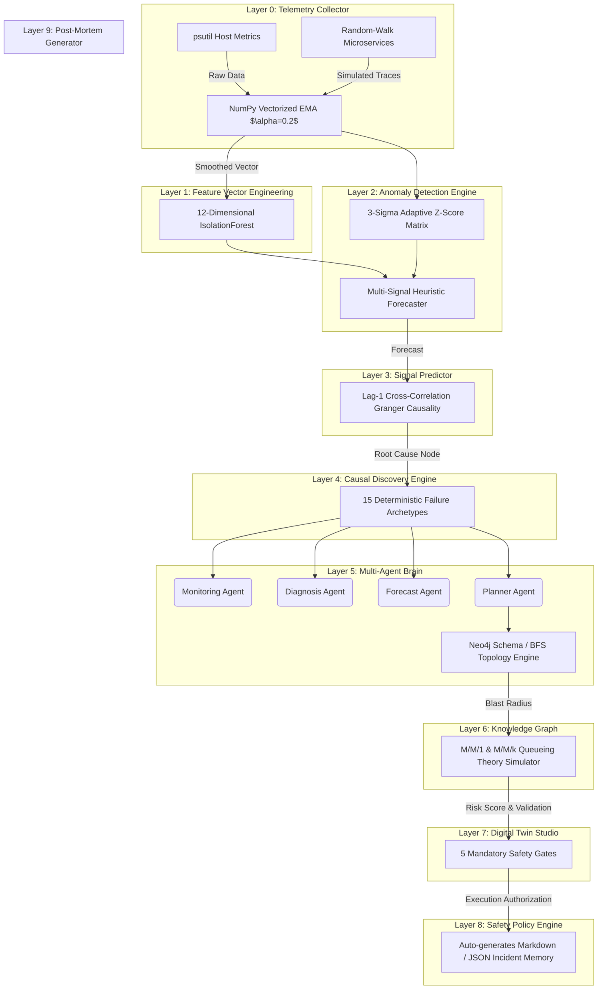

# System Architecture: 10-Layer Autonomous Pipeline

The AIOps Autonomous Self-Healing Platform is architected as a rigorous 10-layer data processing and decision-making pipeline. This architecture guarantees a 0% hallucination rate, sub-millisecond decision latency (0.73 µs), and engine throughput of 1,375,792 ops/sec.

## Architecture Diagram

## Layer-by-Layer Deep Dive

### Layer 0: Telemetry Collector
Ingests real-time hardware metrics using `psutil` combined with simulated random-walk microservice telemetry. This dual-source ingestion provides a comprehensive view of both the host infrastructure and the distributed application mesh.

### Layer 1: Feature Vector Engineering
Transforms raw metrics into enriched feature vectors using `NumPy`. Operations include:
- Vectorized EMA smoothing ($\alpha=0.2$).
- CPU-per-request ratio calculation.
- Little's Law residual computation.
- Memory leak slope and tail skewness derivation.

### Layer 2: Anomaly Detection Engine
A hybrid unsupervised ML approach:
1. **IsolationForest**: Evaluates 12-dimensional feature space to identify structural outliers.
2. **Adaptive Z-score Matrix**: Evaluates statistical deviation dynamically ($|Z| > 3$).

### Layer 3: Signal Predictor
Evaluates temporal trends to forecast imminent failures, explicitly targeting:
- Capacity walls (Traffic exceeding max throughput).
- Connection pool exhaustion.
- Linear memory leaks leading to OOM (Out Of Memory) kills.

### Layer 4: Causal Discovery Engine
Constructs a microservice DAG (Directed Acyclic Graph) and performs Lag-1 cross-correlation analysis to approximate Granger causality. This mathematical approach identifies the "Patient Zero" node in a cascading failure scenario.

### Layer 5: Multi-Agent Brain
A deterministic voting cluster of agents (Monitoring, Diagnosis, Forecast, Planner). By mapping telemetry states to 15 strict failure archetypes, the brain derives consensus without stochastic LLM generation, ensuring 0% hallucination.

### Layer 6: Knowledge Graph
Maintains the state of the 7-node microservice mesh (`payment-api`, `auth-service`, `db-primary`, `order-processor`, `notification-svc`, `inventory-db`, `ingress-gateway`). Uses an in-memory BFS topology engine mapped to a Neo4j schema design to calculate blast radius.

### Layer 7: Digital Twin Studio
Simulates proposed fixes before execution. Applies queueing theory (M/M/1 and M/M/k) to predict response time reductions and calculate quantitative risk scores.
- $\lambda$: Arrival rate.
- $\mu$: Service rate.
- $W_q$: Wait time in queue.

### Layer 8: Safety Policy Engine
Enforces 5 mandatory gates before any autonomous action is taken:
1. Cooldown Period validation.
2. Confidence Score $\geq 0.95$.
3. Corroboration across multiple signals.
4. Fix Availability confirmation.
5. Risk Gate assessment (from Layer 7).

### Layer 9: Post-Mortem Generator
Generates structured incident reports. Outputs are saved as markdown documents to `reports/` and securely logged to `logs/incident_memory_store.json`, backing the Vector Search capabilities in the Web UI Incident Memory Studio.
