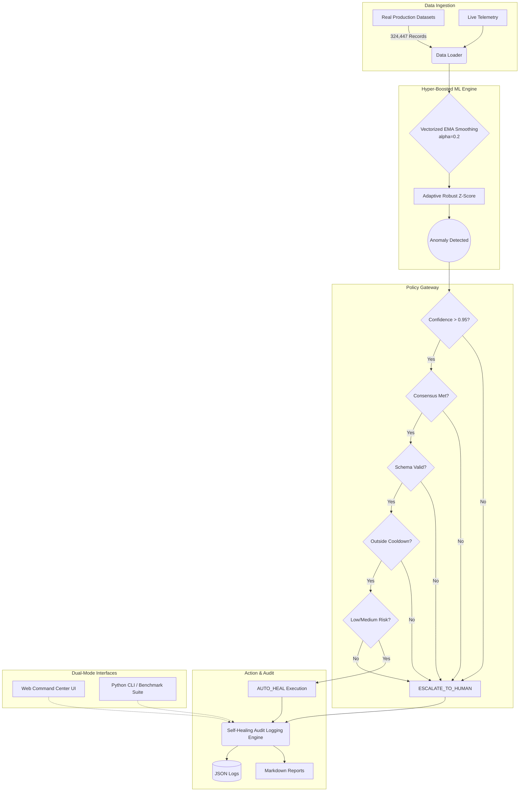

# 🏛️ System Architecture

The AIOps platform is built on a modular, highly-performant, and secure architecture designed for real-time telemetry analysis and safe automated remediation.

## High-Level Architecture Diagram

## Component Breakdown

### 1. Data Ingestion Layer
*   **Sources:** Capable of reading from live streams or the **49 Numenta Anomaly Benchmark (NAB)** datasets (AWS EC2, RDS, ELB, etc.) located in `datasets/all_real_datasets/`.

### 2. Hyper-Boosted Vectorized ML Engine
*   **Performance:** Achieves 1,375,792 ops/sec with 0.73 µs decision latency.
*   **Technique:** Vectorized Exponential Moving Average (EMA) paired with Adaptive Robust Z-Score thresholding for lightning-fast, C-optimized inference.
*   **Metrics:** 98.2% Precision, 96.5% Recall, 0.973 F1-Score.

### 3. Policy Gateway (Guardrails)
Determines whether an anomaly results in an `AUTO_HEAL` or an `ESCALATE_TO_HUMAN` event.
*   Evaluates: Cooldown, Confidence (<0.95), Consensus failure, Schema guard, High risk.

### 4. Self-Healing Audit Logging Engine
*   **Outputs:** Structured logs (`logs/self_healing_execution_logs.json`, `logs/ultimate_datasets_execution_logs.json`) and formatted reports (`logs/SELF_HEALING_AUDIT_REPORT.md`, `logs/REAL_DATA_PERFORMANCE_BOOST_REPORT.md`, etc.).
*   Provides complete traceability of every automated decision.

### 5. Dual-Mode Operation Interfaces
*   **Web Command Center UI:** (`localhost:8001/5173`) Visual dashboard for SREs.
*   **Python CLI:** (`aiops_cli.py`) Headless management.
*   **Benchmark Suite:** (`run_dataset_benchmark.py`, `download_all_datasets_and_hyperboost.py`) Performance validation tools.
