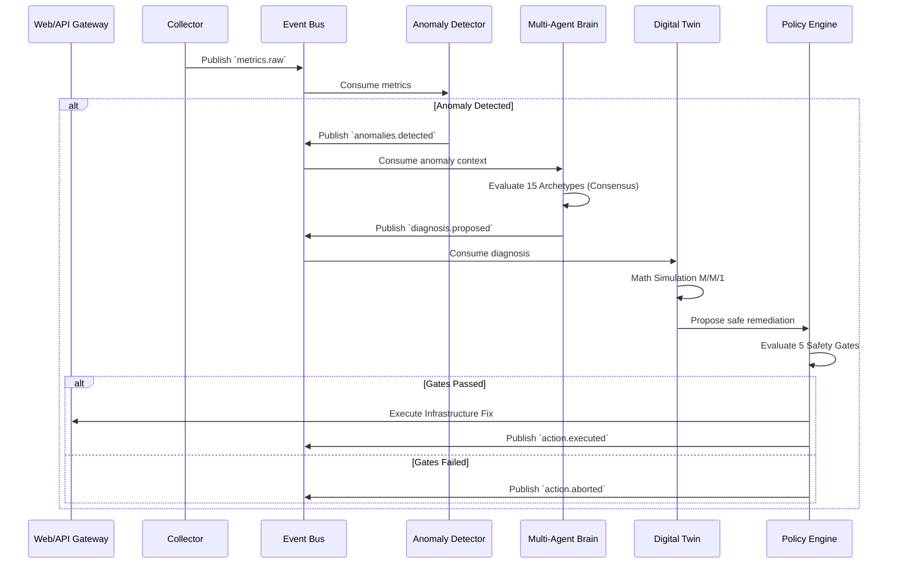

# System Architecture Specification

This document provides a deep technical specification of the AIOps Autonomous Self-Healing Platform, intended for academic evaluators and systems engineers.

## 10-Layer Pipeline Specification

The core of the platform is a strict, sequential 10-layer pipeline designed to transform raw telemetry into safe, automated infrastructure changes.

1.  **Layer 0: Telemetry Collector.** Gathers system metrics (psutil) and application telemetry. Uses a random-walk simulation model to simulate baseline traffic patterns and inject realistic variance.
2.  **Layer 1: Feature Engineering.** Transforms raw metrics into 12-dimensional vectors using NumPy. Key derived features include `cpu_per_request`, `memory_leak_slope` (linear regression over time window), and Little's Law residuals (calculating expected vs actual queue depth).
3.  **Layer 2: Anomaly Detection.** Utilizes `scikit-learn` Isolation Forest for unsupervised outlier detection, backed by a fast 3-sigma (Standard Deviation) statistical filter to catch obvious spikes without ML overhead.
4.  **Layer 3: Signal Predictor.** Multi-signal heuristic engine that predicts impending failures before they crash the system (e.g., projecting when a memory leak will hit OOM, or projecting capacity walls).
5.  **Layer 4: Causal Discovery.** Implements lag-1 cross-correlation and approximations of Granger Causality to determine directionality of faults (e.g., did the DB latency cause the API queue to backup, or vice versa?).
6.  **Layer 5: Multi-Agent Brain.** A deterministic diagnosis engine utilizing 15 pre-defined SRE archetypes. Employs 4 agent types: Monitor, Diagnoser, Forecaster, and Planner. They utilize a consensus algorithm to agree on the root cause.
7.  **Layer 6: Knowledge Graph.** Neo4j database storing topological relationships. Used to calculate "blast radius" via Breadth-First Search (BFS). If a minor service is failing, the graph reveals what critical user paths are affected.
8.  **Layer 7: Digital Twin Simulator.** Applies M/M/1 and M/M/c queueing theory mathematics to simulate the proposed fix. 
9.  **Layer 8: Policy Engine.** A strict safety validator applying 5 sequential gates (Cooldown, Confidence, Corroboration, Availability, Risk). Aborts unsafe fixes.
10. **Layer 9: Post-Mortem Generator.** Synthesizes the telemetry context, diagnosis, and action taken into a comprehensive Markdown incident report.

## Event-Driven Data Flow & Kafka Topic Map

In Production (Docker) mode, data flows asynchronously via Apache Kafka.

| Topic Name | Producer | Consumer | Payload Schema (JSON) |
|---|---|---|---|
| `metrics.raw` | Layer 0 | Layer 1, TSDB | `{"ts": int, "cpu": float, "mem": float, "req_sec": int}` |
| `metrics.features`| Layer 1 | Layer 2 | `{"ts": int, "features": [float, float...], "service": str}` |
| `anomalies.detected`| Layer 2 | Layer 3, Layer 4 | `{"anomaly_id": uuid, "severity": str, "vector": []}` |
| `diagnosis.proposed`| Layer 5 | Layer 7 | `{"incident_id": uuid, "archetype": str, "confidence": float}`|
| `remediation.planned`| Layer 7 | Layer 8 | `{"action": str, "target": str, "simulated_latency": float}`|
| `action.executed` | Layer 8 | Layer 9, UI | `{"status": "success|aborted", "reason": str}` |

## Service Interaction Diagram

## CLI vs Docker Architecture Comparison

| Feature | Docker Compose Mode | Standalone Python CLI Mode |
|---|---|---|
| **Communication** | Async Kafka Topics | Synchronous In-Memory Function Calls |
| **Telemetry Storage** | InfluxDB | Fixed-size In-Memory Ring Buffer (collections.deque) |
| **Topology Data** | Neo4j Graph DB | In-Memory NetworkX Graph / Dictionary |
| **Incident Memory** | ChromaDB (Vector Search) | In-Memory Dictionary Search |
| **UI** | React/Vite Dashboard | Rich Terminal Output (Text/Tables) |
| **Latency** | Network + I/O overhead | Nanosecond CPU speed |

## Multi-Agent Rule Engine Specification

The Layer 5 brain avoids non-deterministic LLMs by using a matrix of boolean triggers based on the feature vector. For example, the `Connection Pool Exhaustion` archetype requires:
*   `active_connections` >= `max_pool_size` * 0.95
*   `query_latency` derivative is positive (increasing)
*   `cpu_utilization` is nominal (< 70%) - *Differentiates from CPU starvation*

If these exact conditions are met, the deterministic brain outputs the diagnosis with 1.0 confidence, allowing the system to proceed safely.

## Digital Twin: Queueing Theory Mathematics

Layer 7 uses Kendall's notation (M/M/1 or M/M/c models) to simulate fixes.
Given arrival rate $\lambda$ (requests per second) and service rate $\mu$ (requests processed per second):

Current Utilization ($\rho$) = $\lambda / \mu$
Expected Wait Time = $1 / (\mu - \lambda)$

When the proposed fix is `increase_capacity` by 2x:
The twin calculates new expected wait time = $1 / ((2 * \mu) - \lambda)$.
If this new wait time violates the defined SLA, or if $\rho \ge 1$ (unstable queue), the simulation fails, and the Policy Engine aborts the fix.
